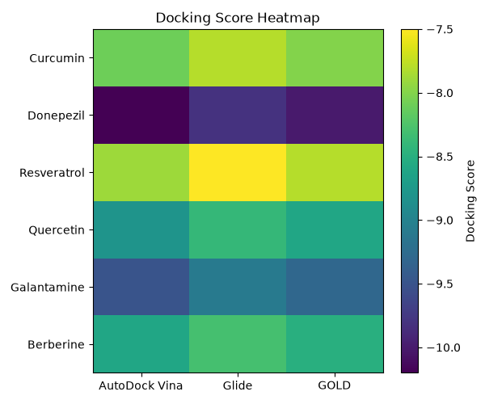
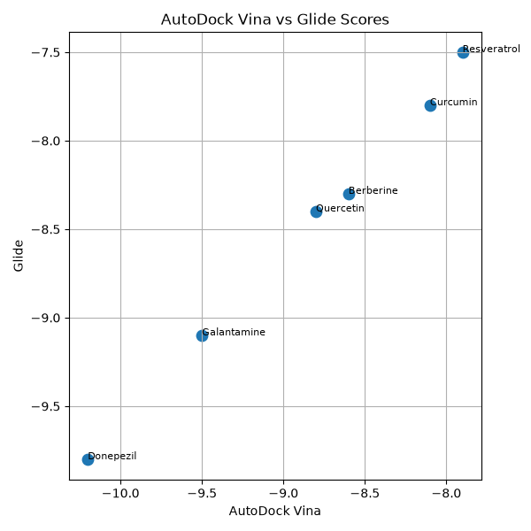

# 🧠 NeuroDock
**Version:** 1.0.0
> A beginner-friendly computational drug discovery project demonstrating consensus molecular docking for Alzheimer's disease.


---

## 📖 Overview

NeuroDock is a computational biology project that demonstrates how **consensus molecular docking** can improve ligand ranking by combining results from multiple docking programs.

Instead of relying on a single docking algorithm, this project calculates an average **consensus score** from AutoDock Vina, Glide, and GOLD to identify promising Alzheimer's disease drug candidates.

---
## 🛠 Key Technologies

- **Python** – Data analysis and scripting
- **Pandas** – Data manipulation
- **NumPy** – Numerical computations
- **Matplotlib** – Scientific visualizations
- **Biopython** – Protein structure analysis
- **Jupyter Notebook** – Interactive analysis
- **Git & GitHub** – Version control and collaboration

## 🧬 Biological Target

This project focuses on **Acetylcholinesterase (AChE)**, an important therapeutic target in Alzheimer's disease.

AChE breaks down the neurotransmitter acetylcholine. Inhibiting this enzyme increases acetylcholine levels, helping improve memory and cognitive function in Alzheimer's patients.

---

## 🎯 Objectives

- Calculate consensus docking scores
- Rank ligands based on predicted binding affinity
- Generate statistical summaries
- Visualize docking results
- Demonstrate a reproducible computational biology workflow
- Learn Git, GitHub, Python, and Jupyter Notebook

---
## ✅ Project Features

| Feature | Status |
|---------|:------:|
| Consensus Docking Analysis | ✅ |
| Ligand Ranking | ✅ |
| Data Visualization | ✅ |
| Statistical Analysis | ✅ |
| Jupyter Notebook | ✅ |
| Protein Structure Analysis | ✅ |
| Automatic Report Generation | ✅ |
| Professional Documentation | ✅ |

## 📂 Project Structure

```text
NeuroDock/
│
├── data/
│   ├── docking_scores.csv
│   └── protein_info.txt
│
├── figures/
│   ├── consensus_scores.png
│   ├── docking_heatmap.png
│   └── docking_comparison.png
│
├── notebooks/
│   └── NeuroDock_Analysis.ipynb
│
├── references/
│   └── references.md
│
├── results/
│   ├── ranked_ligands.csv
│   └── analysis_report.txt
│
├── scripts/
│   └── analysis.py
│
├── requirements.txt
└── README.md
```

---

## ⚙️ Workflow

The NeuroDock workflow consists of the following steps:

1. Load docking scores from a CSV dataset.
2. Calculate a consensus score by averaging three docking programs.
3. Rank ligands according to their consensus score.
4. Generate summary statistics.
5. Visualize the results using graphs.
6. Save ranked results and an analysis report.

### Workflow Diagram

```text
Docking Scores (CSV)
        │
        ▼
Load Data (Pandas)
        │
        ▼
Calculate Consensus Score
        │
        ▼
Rank Ligands
        │
        ▼
Generate Statistics
        │
        ▼
Create Visualizations
        │
        ▼
Generate Report
```

---

## 📊 Sample Results

### Consensus Docking Scores


### Docking Score Heatmap



### Docking Comparison



---

## 📓 Jupyter Notebook

The repository also includes an interactive Jupyter Notebook:

```
notebooks/NeuroDock_Analysis.ipynb
```

The notebook demonstrates:

- Data loading
- Consensus score calculation
- Ligand ranking
- Statistical analysis
- Data visualization
- Interpretation of results

---

## 🛠 Technologies Used

- Python
- Pandas
- NumPy
- Matplotlib
- Jupyter Notebook
- Git
- GitHub

---

## 🚀 Installation

Clone the repository:

```bash
git clone https://github.com/kirthimaheswaran/NeuroDock.git
```

Move into the project folder:

```bash
cd NeuroDock
```

Install dependencies:

```bash
pip install -r requirements.txt
```

Run the analysis:

```bash
python3 scripts/analysis.py
```

Launch the Jupyter Notebook:

```bash
jupyter notebook
```

---

## 📈 Project Outputs

Running the project generates:

- Ranked ligand table
- Consensus docking scores
- Heatmap visualization
- Scatter plot comparison
- Analysis report
- Jupyter notebook visualizations

---
## 📌 Results Summary

The project successfully:

- Calculated consensus docking scores for multiple ligands.
- Ranked compounds based on predicted binding affinity.
- Generated bar charts, heatmaps, scatter plots, and histograms.
- Produced automated analysis reports.
- Analysed a real protein structure using Biopython.

## 🔬 Future Improvements

- Integrate real Alzheimer's disease docking datasets
- Analyse larger ligand libraries
- Add statistical hypothesis testing
- Compare additional docking software
- Visualize molecular structures
- Develop a Streamlit web application
- Extend the workflow to other neurological targets

---

## 👩‍💻 Author

**Kirthi Maheswaran**

Computational Biology | Bioinformatics | Neuroscience Enthusiast

---

## ⭐ Acknowledgements

This project was created as a learning portfolio to explore computational drug discovery, Python programming, Git/GitHub, and scientific data visualization.