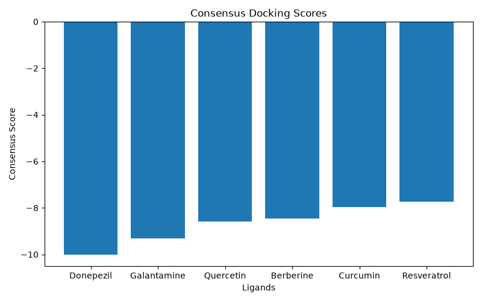

# 🧠 NeuroDock

> A beginner-friendly computational drug discovery project demonstrating consensus molecular docking for Alzheimer's disease.

---

## 📖 Overview

NeuroDock is a computational biology project that demonstrates how consensus docking can improve ligand ranking by combining results from multiple docking software.

Instead of relying on one docking algorithm, this project calculates an average consensus score from multiple docking programs.
## Workflow

The NeuroDock workflow consists of the following steps:

1. Load docking scores from a CSV file.
2. Calculate a consensus score by averaging results from three docking programs.
3. Rank ligands according to their consensus scores.
4. Generate statistical summaries.
5. Create graphs to visualize the results.
6. Save the ranked results and analysis report.

---

## 🎯 Objectives

- Calculate consensus docking scores
- Rank ligands based on predicted binding affinity
- Visualize docking results
- Demonstrate a reproducible computational workflow

---

## 📂 Project Structure

```
NeuroDock/
│
├── data/
│   └── docking_scores.csv
│
├── figures/
│   └── consensus_scores.png
│
├── notebooks/
│
├── results/
│   └── ranked_ligands.csv
│
├── scripts/
│   └── analysis.py
│
├── requirements.txt
└── README.md
```

---

## 📊 Workflow

Dataset
⬇
Consensus Score Calculation
⬇
Ligand Ranking
⬇
Visualization
⬇
Results

---

## 📈 Example Output

The figure below shows the consensus docking scores calculated from the three docking programs.



The ranked ligand results are automatically saved in:

```text
results/ranked_ligands.csv
```

## 🛠 Technologies Used

- Python
- Pandas
- Matplotlib
- Git
- GitHub

---

## 🚀 How to Run

Clone the repository:

```bash
git clone https://github.com/kirthimaheswaran/NeuroDock.git
```

Install dependencies:

```bash
pip install -r requirements.txt
```

Run the analysis:

```bash
python3 scripts/analysis.py
```

---

## 🔬 Future Improvements

- Use real Alzheimer's disease docking data
- Add statistical analysis
- Compare multiple docking programs
- Create an interactive Jupyter Notebook
- Include molecular structure visualization

---

## 👩‍💻 Author

**Kirthi Maheswaran**

Computational Biology | Bioinformatics | Neuroscience Enthusiast